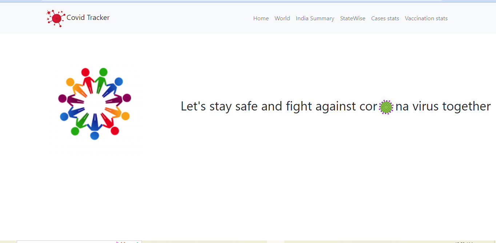
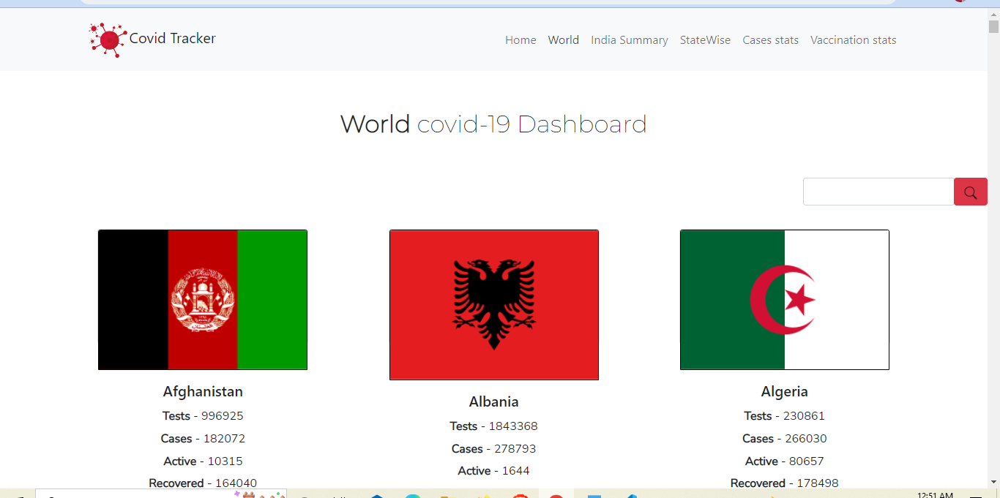
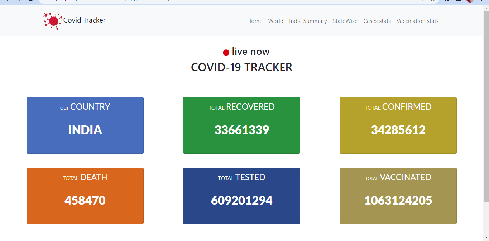
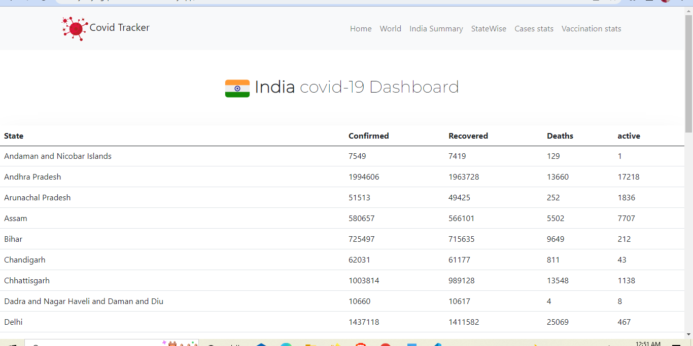
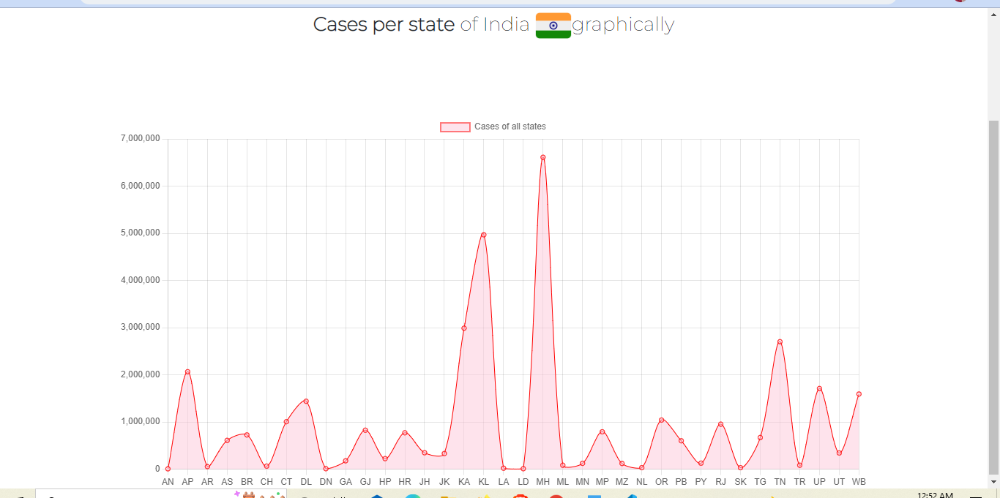
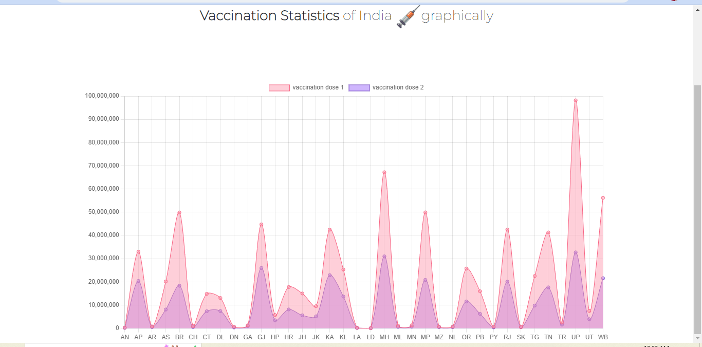

## Table of Contents
1. [General Info](#general-info)
2. [Live Demo](#live-demo)
3. [Technologies](#technologies)
4. [Installation](#installation)
5. [Features](#features)
### General Info
***
As covid -19 has grown to a large scale a great number of people have been affected, so In this project going to implement a real time covid tracker app give giving information about covid -19 cases at a particular time of a particular state of India using JavaScript and its library react, it will use fetching of API’s and data extraction , and it will use concept of oops manipulating data received from API in form of JSON (JavaScript Object Notation) and handling those objects using classes and components in JavaScript. It will consist of an interactive UI with graphics for better interaction of web app with user.
The app will give information about total confirmed cases, total recovered cases, total deaths and more information about India and other countries in the world dynamically updating itself every time, data is changed at the backend to give exact information to the user.


## Live Demo 
***


* Documentation Link: https://drive.google.com/file/d/1JEaTmakwyBlCfDrzYskuF6CGAHFItm7T/view?usp=sharing
* App Link: https://mystifying-poincare-ec65a7.netlify.app/

## 


### Screenshots
* Home Page



* World Dashboard page

 

* India Summary page



* India State Dashboard



* Graphical data of cases of each state 



* Vaccination stats in graphical mode of each state



## Technologies
***
A list of technologies used within the project:
* React JS
* Chart JS
* Bootstrap
* Covid-19 API 


## Installation
***
A little intro about the installation. 
```
$ git clone https://github.com/garvitbatra02/Covid-Tracker

```

In Covid-Tracker
```
$ npm install
$ npm start

```


## Features
***
Covid-Tracker features:
* Interactive UI to show covid cases
* Real time cases information
* Quick and fast UI for better user interactivity
* Better to grasp information through chart information
* Dashboard that shows total confirmed, deaths, recovered, tested, vaccinated numbers of the people in India 
* Better to grasp information through chart information
* Here a search button has been provided that carries special functionality of searching the country that we want to look by method substring comparing and conditional rendering in react. It basically searches or filters all countries which fits in search results.

## 


## Conclusion


This project aimed towards providing information about covid-19 cases over the whole world with every particular details of every country. A special emphasis has been made for country India  with details in various type representation Tabular ,graphical etc .With special hover functionality, it’s a great web app for information purpose but more functionality can be increased if mapbox and geolocation facilities are used to display covid density across the world in 
Clear and clean way.


## 
